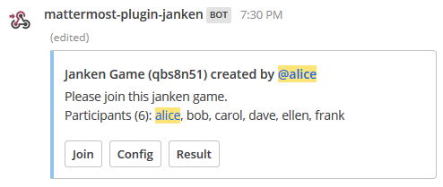
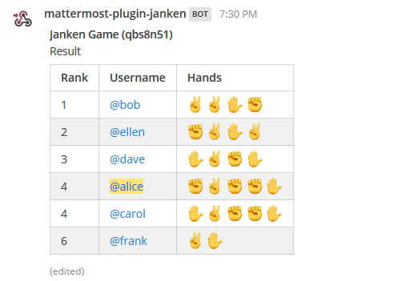
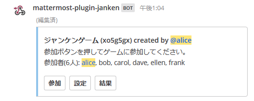

mattermost-plugin-janken
========================

This plugin add a slash command that you can play janken game.

```
/janken
```





## Installation

Go to the [release page](https://github.com/yiwkr/mattermost-plugin-janken/releases) of this Github repository and download the latest release. You can upload this file in the Mattermost system console to install the plugin.

## Language

You can change the default language from the system console.

You can also change language when you create a janken game by using `-l` option.

Now available languages are English ("en") and Japanese ("ja").

Example to use japanese

```
/janken -l ja
```


